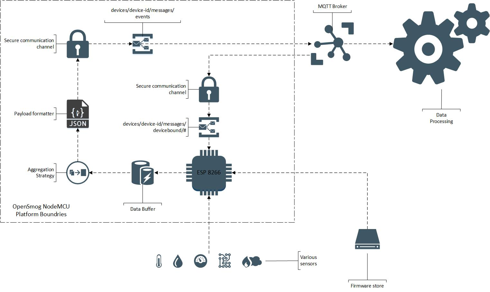

# OpenSmog NodeMCU Platform - OSNP v 1.0.0

[TOC]

## Change log
| Version | Description
|:---:|---|
|1.0.0 | Initial system description

## Description

Opsen Smoge NodeMCU Platform is opens source and open hardware platform allowing users and developers to connecty any kind of hardware sensors and transsmit data back to OpenSmog backend throug MQTT protocol.
Software is designed to run on ESP8266 boards in any version capable to work under NodeMCU firmware.

## Key features

* Works under NodeMCU firmware
* Handle data transfering via MQTT protocol
* Ensure data is encrypted and device is authenticated against OpenSmoge backend (Azure IoT Hub)
* Handle data buffering and throttling.
* Managed from backend.
* OTA (over the air) software updates.
* Easy to use setup via web page.
* mDNS support - no IP needed to acces device from local network.
* Status page showing actual device status (connection, security, mesurements)

## Platform diagram



## Data transfer: MQTT & Security

### Authentication and security

Platform is sending sensor data to MQTT broker via secured TSL connection. Each device authenticate using **device-id** generated when device is registered and pair of access keys: primary and secondary access key. Normally device use primary key, but in case of key compromising device use secondary key to authenticate and request new pair of keys.

### Sending mesurements to backend

Device is sending data to backend on well defined events topic. All data are serialized to JSON accordingly to JSON payload described in AcquisitionAPI.
Sending data is managed internally and may by throttled.

```
TOPIC NAME: devices/device-id/messages/events
```

*where device-id is uniq identifier of phisical device created during device registration process.*

### Cloud to device - remote management

Platform is supporting C2D (cloud to device) communication channel for remote management. Currently there are 4 remotely managed areas:

* Software updates.
* Security keys updates.
* Throttling settings.
* Buffer aggregation strategy.

```
TOPIC NAME: devices/device-id/messages/devicebound/#
```

*where device-id is uniq identifier of phisical device created during device registration process.*

## Data buffering

To ensure data are sent in proper way with respect to throttling settings device developer is not sending data directly to MQTT topic, but put them into buffer, which is being automaticaly flused to the backend. Buffer may apply one of below data aggregation strategy depends on setting recieved from backend:

* Packaging - all mesurements are send to backend in one package.
* Average - average value od buffer with additonal min and max values is send to backend.
* Median - median value of buffer with additonal min and max values is send to backend.

OpenSmog NodeMCU Platform expose simple interface to put sensor data into buffer using fire & forget strategy: device developer may not care what happends with data in buffer, just assume that all will be properly transfered to the backend. 

```
StoreData(sensor, value)
```

## OTA - Software updates

To avoid phisical maintanance of device in terms of software update, platform uses OTA software and configuration updates model. 

## Web setup

Initial configuration like WiFi settings, deviceId and security keys are provided via web interface during initial setup when OSNP works in Acces Point mode exposing own network OpenSmog_XXXX. After providing all requiered data device reboots join provied network and start sending sensor data to the backend. If reconfiguration is needed end user may use hardware reset button to restore device to factory defalts.

## Status page and mDNS

Properly configured device expose via mDNS web server named OpenSmog which end user can access with web browswer and see actual device status, configuration, software version and snapshot of sensor mesurements for last couple of hours.